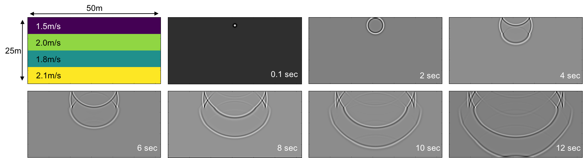

# C++ 2D Wave Equation Solver

A minimal 2D wave equation solver for a variable velocity model using the finite difference method.



*Velocity model (top-left) and modelled pressure at increasing times. Reflections from the first velocity contrast can be seen from 4 seconds, and an emergent head-wave can be observed at 10-12 seconds.*

## Formulation

### 1. The wave equation

The 2D wave equation is defined as follows:

$$
\frac{\partial^2 u}{\partial t^2} = \gamma\left(\frac{\partial^2 u}{\partial x^2} + \frac{\partial^2 u}{\partial y^2}\right)
$$

where $u$ is the pressure, $t$ is time, $\gamma=v^{2}$, and $v$ is the velocity of the medium that the wave is travelling through.

### 2. Discretization and finite differences

A numerical solution to the wave equation can be obtained using the finite difference method (FDM). In order to implement the FDM, the space and time domains are discretized as follows:

$$
x_{i} = i \Delta x\ \ \ \textup{for}\ i = 0, 1, 2,...,n_{x}-1,
$$

$$
y_{j} = j \Delta y\ \ \ \textup{for}\ j = 0,1,2,...,n_{y}-1,
$$

$$
t_{l} = l \Delta t\ \ \ \textup{for}\ l = 0,1,2,...,n_{t}-1.
$$

The wave equation can then be expressed as

$$
\frac{\partial^2 u}{\partial t^2}=\frac{\partial }{\partial x}\left ( \gamma \frac{\partial u}{\partial x} \right )+\frac{\partial }{\partial y}\left ( \gamma \frac{\partial u }{\partial y} \right ).
$$

The components on the right-hand side were approximated by finite differences in two stages:

1. The outer expression for each component was discretized as follows:

$$
\frac{\partial }{\partial x}\left ( \gamma \frac{\partial u}{\partial x} \right )\approx \frac{1}{\Delta x}\left ( \gamma\frac{\partial u}{\partial x}\bigg\rvert_{x=x_{i}+0.5} - \gamma\frac{\partial u}{\partial x}\bigg\rvert_{x=x_{i}-0.5} \right ).
$$

2. The inner expressions were then approximated by the following:

$$
\begin{align*}
\gamma\frac{\partial u}{\partial x}\bigg\rvert_{x=x_{i}+0.5}&\approx 0.5(\gamma_{i}+\gamma_{i+ 0.5})\frac{u_{i+1}+u_{i}}{\Delta x}, \\
\gamma\frac{\partial u}{\partial x}\bigg\rvert_{x=x_{i}-0.5}&\approx 0.5(\gamma_{i}+\gamma_{i- 0.5})\frac{u_{i}-u_{i-1}}{\Delta x}
\end{align*}
$$

The term on the left-hand side was then approximated by the following finite difference expression:

$$
\frac{\partial^2 u}{\partial t^2}\approx \frac{u_{ij}^{l-1}-2u_{ij}^{l}+u_{ij}^{l+1}}{\Delta t^{2}}.
$$

Substituting the above expressions into wave equation and rearranging yields the following formula for calculating the pressure, $u_{ij}$, at the future time-step, $t=l+1$:

$$
u_{ij}^{l+1}=2u_{ij}^{l}-u_{ij}^{l-1}+\Psi_{ij}
$$

where $\Psi_{ij}$ was defined as follows:

$$
\begin{align*}
\Psi_{ij}&=\frac{\Delta t^{2}}{\Delta x}\left ( 0.5(\gamma_{ij}+\gamma_{i+1,j})\frac{u_{i+1,j}-u_{ij}}{\Delta x} - 0.5(\gamma_{ij}+\gamma_{i-1,j})\frac{u_{ij}-u_{i-1,j}}{\Delta x} \right )\\
&\quad +\frac{\Delta t^{2}}{\Delta y}\left ( 0.5(\gamma_{ij}+\gamma_{i,j+1})\frac{u_{i,j+1}-u_{ij}}{\Delta y} - 0.5(\gamma_{ij}+\gamma_{i,j-1})\frac{u_{ij}-u_{i,j-1}}{\Delta y} \right ).
\end{align*}
$$

This time-stepping expression is used to update the state of the inner points of the domain for each time increment. 

### 3. Initial conditions

Initial conditions are required at $t=0$. Firstly, $u(t=0,x,y)=I(x,y)$ was used to define $u_{ij}^{l=0}$. $I(x,y)$ was chosen to be the Ricker wavelet function:

$$
I(x,y)=\frac{a}{\pi s^{2}}\left ( 1 - 0.5 \left ( \frac{x^{2}+y^{2}}{s^{2}} \right ) \right )e^{-\frac{x^{2}-y^{2}}{2s^{2}}}
$$

where $a$ is the amplitude and $s$ is the spread. Secondly, $\frac{\partial u}{\partial t}(t=0,x,y)=0$ was approximated as follows:

$$
\frac{\partial u}{\partial t}\approx \frac{u_{ij}^{l+1}-u_{ij}^{l-1}}{2\Delta t}=0,
$$

illustrating that $u_{ij}^{l+1}=u_{ij}^{l-1}$. Substituting $u_{ij}^{l+1}$ for $u_{ij}^{l-1}$ in equation 3, rearranging, and utilizing the fact that $u_{ij}^{l+1}=u_{ij}^{l-1}$, the following expression for the fictitious value of $u_{ij}^{l-1}$ at $t=0$ is obtained:

$$
u_{ij}^{l-1}=u_{ij}^{l}+\frac{\Psi_{ij}}{2}
$$

### 4. Algorithm

The basic algorithm for the program can then be expressed as follows:

1. Set initial condition for all points: $u_{ij}^{l=0}=I(x,y)$
2. Set fictitious prior displacement for inner points: $u_{ij}^{l-1}=u_{ij}^{l}+\frac{\Psi_{ij}}{2}$
3. While $t\lt n_{t}$, update inner points: $u_{ij}^{l+1}=2u_{ij}^{l}-u_{ij}^{l-1}+\Psi_{ij}$
4. While $t\lt n_{t}$, initialise all points for the next time-step: $u_{ij}^{l-1}=u_{ij}^{l}$, $u_{ij}^{l}=u_{ij}^{l+1}$, $t=t+\Delta t$

## User instructions

Compile `main.cpp` and run the program:
```bash
g++ main.cpp -o wave-sim
./wave-sim
```

Parameters will be automatically prompted from the user, or they can be defined in `runfile.txt` where they are organised in the following order:
1. Size of the model in $x$ (`lx`)
2. Size of the model in $y$ (`ly`)
3. Spatial grid spacing in $x$ (`dx`)
4. Total time to run simulation (`t`)
5. Courant number (`c`)
6. Velocity of upper layer (`v1`)
7. Velocity of upper-mid layer (`v2`)
8. Velocity of lower-mid layer (`v3`)
9. Velocity of lower layer (`v4`)
10. Source amplitude (`a`)
11. Source spread (`s`)
12. Source location in $x$ given in cells (`ox`)
13. Source location in $x$ given in cells (`oy`)

The program writes a file named `wave-sim.txt` containing the 2D array, $u_{ij}$, at the final specified time, $t$.

Note that no `dy` is required as the model is assumed to be isotropic, and all parameters are given in SI units unless otherwise stated. The boundaries are reflecting ($u=0$), and the Courant number needs to be chosen carefully to avoid numerical dispersion and instability.

## References

- Langtangen, H. P. (2013). *A Primer on Scientific Programming with Python*. Springer.
